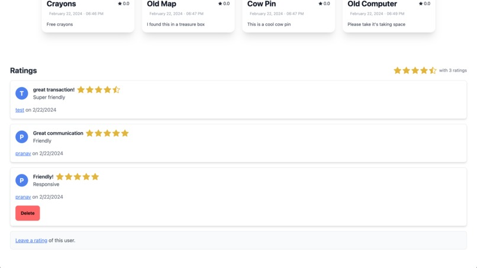
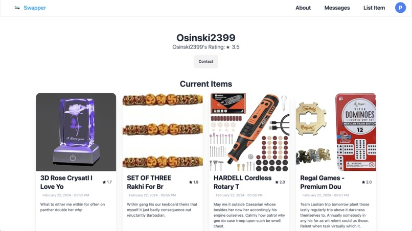

# Swapper

Swapper is an open-source platform designed to revolutionize the way people exchange goods. Whether you're looking to trade, give away, or lend items, Swapper offers an environment where users can connect and facilitate these exchanges with ease through our built-in messaging. Built with a frontend in React with TypeScript, and a backend using RavenDB's Go client to allow for rapid development and a seamless user experience at scale.

## Features

- **User Accounts**: Secure signup and login functionality, including user profiles to manage your items and interactions.
- **Item Listings**: Users can post items they wish to trade, lend, or give away, complete with descriptions, categories, images, and ratings.
- **Messaging System**: A built-in messaging feature that facilitates exchanges by allowing users to communicate directly within the platform, making it easy to negotiate terms or ask questions about items.
- **Ratings and Reviews**: Users can rate and review their experiences with other members, promoting trust and reliability within the community.
- **Search and Filters**: Advanced search options utilizing fuzzy searching over all item fields, and the item attributes and category filters help users find exactly what they're looking regardless of the item's properties.

## Demo

[](https://youtu.be/0oFyaT0ixN0)

## Page Previews

### Home Page


### Item Listing


### Messages


### Reviews


### User Profile


## Getting Started

### Prerequisites

- Go (version 1.21)
- Node.js and npm

### Setup and Installation

1. **Clone the repository**

```sh
git clone https://github.com/yourusername/swapper.git
cd swapper
```
2. **Start the RavenDB Instance and backend**
```sh
cd backend
docker compose up -d
go get
go run main.go
```
3. **Install required npm packages and run dev server**
```sh
cd frontend
npm install
npm run dev
```


